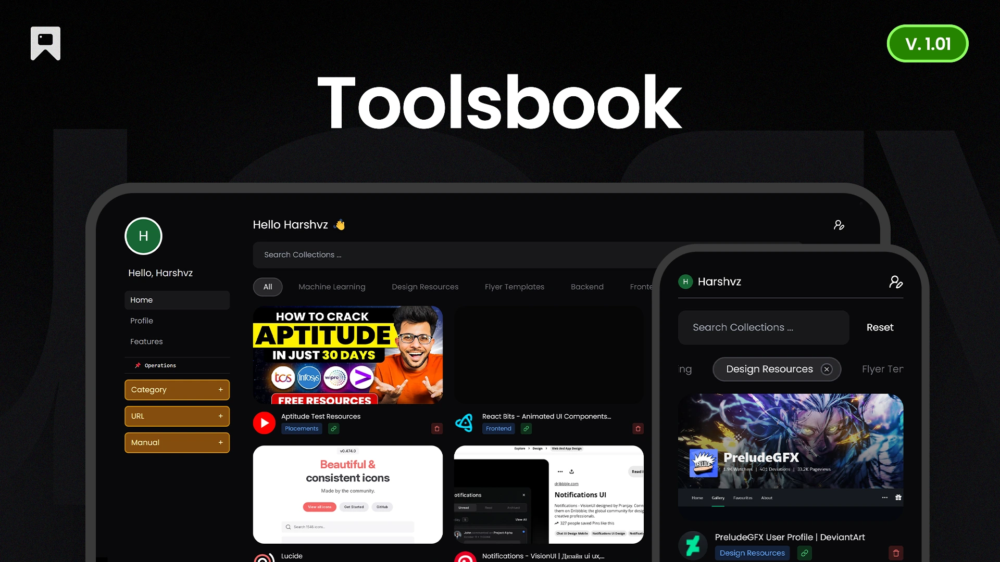

# Toolsbook - Smart Bookmark Manager

  |  | 

 <!-- Add your banner image if available -->

A modern bookmark manager with automated scraping capabilities, built to organize web resources efficiently. Save links with automatic metadata extraction, AI-powered keywords, and smart categorization.

## ✨ Features

### Core Functionality
- **Automated Web Scraping** - Instant metadata extraction from any URL
- **Visual Capture** - Automatic screenshot generation for saved links
- **Smart Organization** - AI-generated keywords and custom categories
- **Advanced Search** - Full-text search across saved content and metadata

### Competitive Advantages
- 🚀 **Zero Manual Entry** - Fully automated data collection
- 🔒 **Privacy First** - End-to-end encrypted storage options
- 💸 **Free Forever** - No paywalls or premium tiers
- 🌓 **Dark Mode** - Native dark theme with eye-friendly design

### Technical Highlights
- ⚡ Instant search with Firestore indexing
- 📸 Firebase Storage for image management
- 🔑 Firebase Authentication (Google/GitHub/Email)
- 📱 PWA-ready progressive web app

## 🛠 Technology Stack

**Frontend**
- React 18 + Vite
- Tailwind CSS (Dark Mode)
- React Router 6
- HTML5/ES6+

**Backend**
- Firebase Authentication
- Cloud Firestore (NoSQL Database)
- Firebase Storage (Image Link Storage)
- Vercel Hosting

**Services**
- Vercel (CI/CD & Deployment)
- Web Scraping API ( Headless Browser Implementation with Puppeter! )
- Automated Screenshot Service
